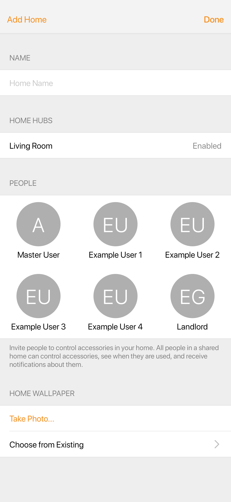
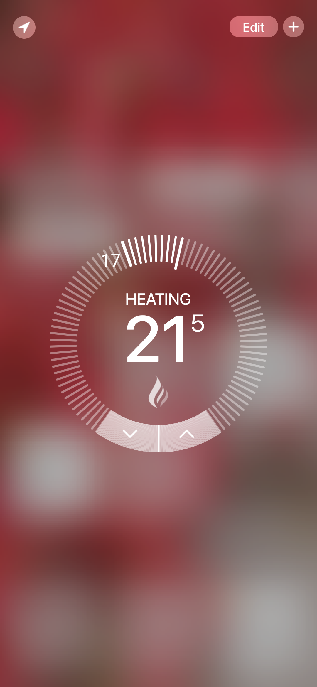
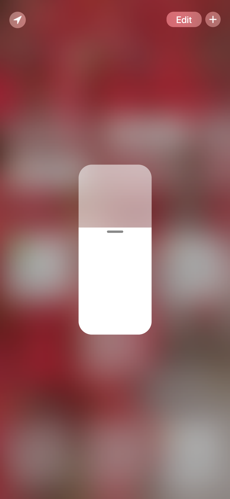
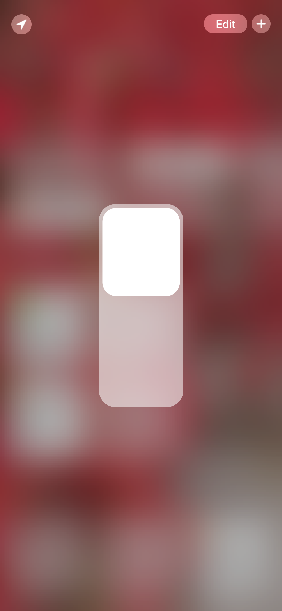

# SmartHome

Experiment to replicate the **UI** of the **Apple Home** app on **Android**, including some of the **animations** also.

## Installation

Clone this repository and import into **Android Studio**
```bash
git clone git@github.com:stormset/SmartHome.git
```

## Configuration

### Remarks

The project does only implement the layout for the **Home screen**, where the controls reside, and also a *sample* **settings screen**.
<br>
Event listeners aren't hooked up either. Therefore it is incomplete.

***The code is quite monolithic, and should be modularized.*** *It's a very old project of mine.* I don't plan on continuing this project.

## Build variants

Use the Android Studio *Build Variants* button to choose between **production** and **staging** flavors combined with debug and release build types

## Screenshots
<p float="left">



</p>
<br>
<p float="left">



</p>

## Contributing

1. Fork it
2. Create your feature branch (git checkout -b my-new-feature)
3. Commit your changes (git commit -m 'Add some feature')
4. Push your branch (git push origin my-new-feature)
5. Create a new Pull Request
